  <h1>Hi there 👋, I'm Yassine SABIR!</h1>
  
 
  

 

<!-- Colored Badges for Technologies using HTML and Shields.io -->
<h3 align="center">🛠️ Technologies & Tools</h3>

  
  
  
  
  
   
  
  
  
   
  
  
    
  

 

<h3 align="center">🔥 GitHub Stats</h3>

  

 

<h3 align="center">📫 Let's Connect</h3>

  
  

  

